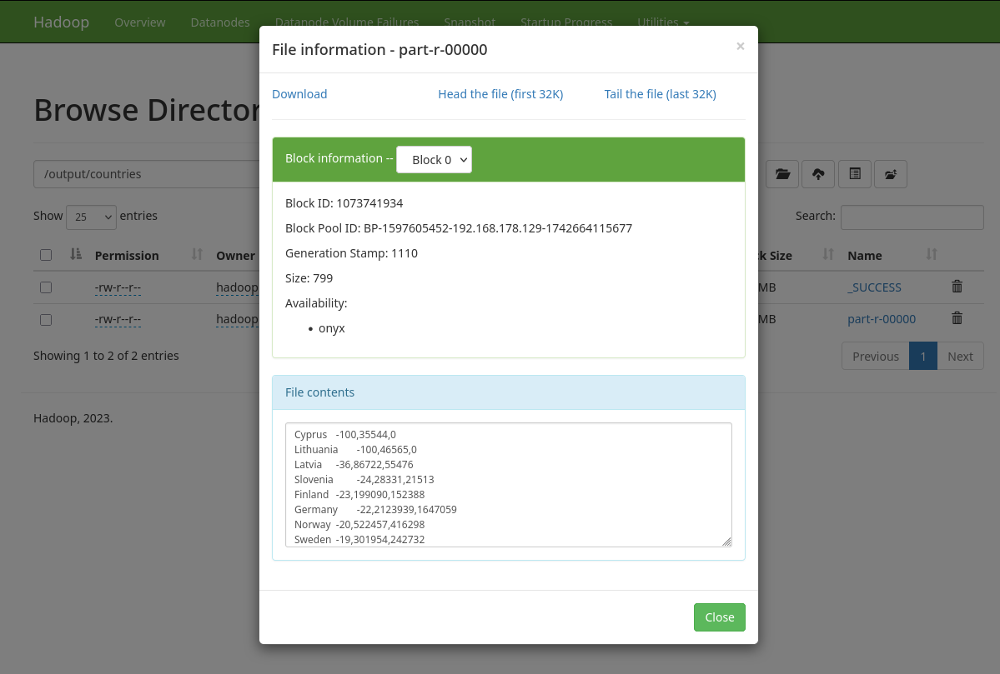
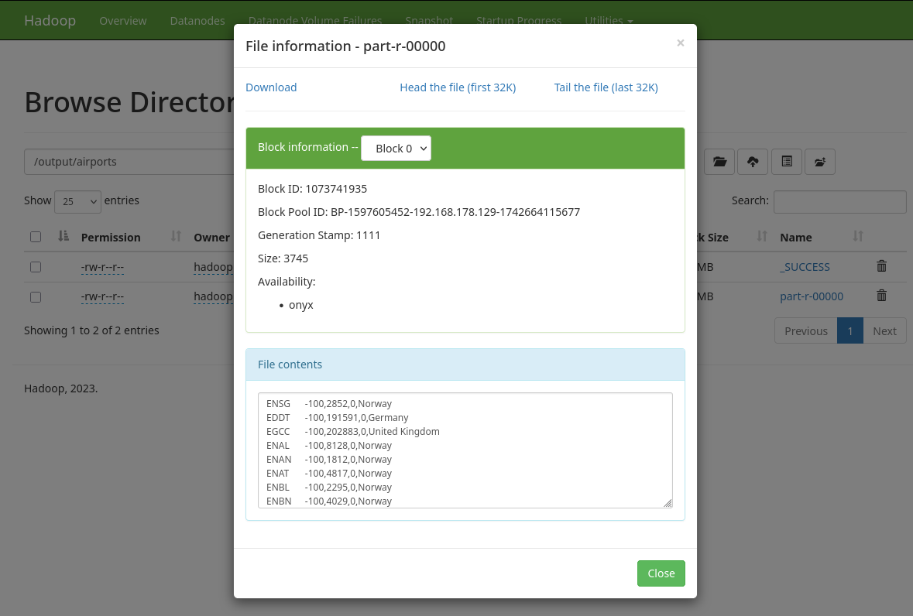

# Hadoop MapReduce Analyse von Flugbewegungen

Dieses Projekt analysiert Flugbewegungen von Verkehrsmaschinen europäischer Flughäfen für die Jahre 2019 und 2024. 

Ziel ist es, die Veränderung der Flugbewegungen von 2019 nach 2024 pro Flughafen und pro Land, in denen die Flughäfen liegen, zu berechnen und die Ergebnisse absteigend nach prozentualer Änderung zu sortieren.

## Datensatz

Grundlage ist die CSV-Datei **[airport_traffic.csv](input/airport_traffic.csv)**, in der detaillierte Informationen über Flugbewegungen per Flughafen und Tag enthalten sind.

<details>
	<summary>
		<b>Die ersten 10 Zeilen der Datei</b>
	</summary>
	
```
YEAR,MONTH_NUM,MONTH_MON,FLT_DATE,APT_ICAO,APT_NAME,STATE_NAME,FLT_DEP_1,FLT_ARR_1,FLT_TOT_1,FLT_DEP_IFR_2,FLT_ARR_IFR_2,FLT_TOT_IFR_2
2019,01,JAN,01-01-19,LATI,Tirana,Albania,29,26,55,,,
2019,01,JAN,01-01-19,UDYZ,Yerevan,Armenia,29,33,62,,,
2019,01,JAN,01-01-19,LOWG,Graz,Austria,5,7,12,,,
2019,01,JAN,01-01-19,LOWI,Innsbruck,Austria,28,26,54,,,
2019,01,JAN,01-01-19,LOWK,Klagenfurt,Austria,4,4,8,,,
2019,01,JAN,01-01-19,LOWL,Linz,Austria,1,2,3,,,
2019,01,JAN,01-01-19,LOWS,Salzburg,Austria,22,26,48,,,
2019,01,JAN,01-01-19,LOWW,Vienna,Austria,257,232,489,257,230,487
[...]
```

</details>

- Die Datei enthält **228.729 Zeilen** mit Flugverkehrsdaten einzelner Flughäfen für die Jahre **2019 und 2024**.  
- Nur Datensätze mit einem gesetzten Wert in der Spalte `FLT_TOT_IFR_2` werden für die Analyse berücksichtigt, da diese die bereits zusammengezählten (total) **Flugbewegungen mit Verkehrsmaschinen (IFR)** darstellen.
- Dies entspricht **72.627 Zeilen (ca. 32%)**, welche sich auf Daten zu Passagiers-Flughäfen begrenzen. 

<details>
<summary>
	<b>Übersicht über die Felder der CSV</b>
</summary>

Die folgende Tabelle gibt eine Übersicht über alle Spalten der CSV und die Anzahl fehlender Einträge:

| Spalte           | Beschreibung                               | Werte / Beispielwerte            | Fehlende Werte |
|------------------|--------------------------------------------|----------------------------------|----------------|
| `YEAR`           | Jahr des Fluges                            | 2019, 2024                       | 0              |
| `MONTH_NUM`      | Monat (numerisch)                          | 1–12                             | 0              |
| `MONTH_MON`      | Monat (Abkürzung, engl.)                   | JAN–DEC                          | 0              |
| `FLT_DATE`       | Datum des Fluges                           | z. B. 01-01-19                   | 0              |
| `APT_ICAO`       | ICAO-Code des Flughafens                   | z. B. LATI, UDYZ, LOWG           | 0              |
| `APT_NAME`       | Name des Flughafens                        | z. B. Tirana, Yerevan, Graz      | 0              |
| `STATE_NAME`     | Land des Flughafens                        | z. B. Albania, Austria, France   | 0              |
| `FLT_DEP_1`      | Abflüge (alle Flüge)                       | 0–847                            | 0              |
| `FLT_ARR_1`      | Ankünfte (alle Flüge)                      | 0–813                            | 0              |
| `FLT_TOT_1`      | Gesamtbewegungen (alle Flüge)              | 0–1628                           | 0              |
| `FLT_DEP_IFR_2`  | Abflüge (Verkehrsmaschinen, IFR)           | 0–852                            | 156.102        |
| `FLT_ARR_IFR_2`  | Ankünfte (Verkehrsmaschinen, IFR)          | 0–819                            | 156.102        |
| `FLT_TOT_IFR_2`  | Gesamtbewegungen (Verkehrsmaschinen, IFR)  | 0–1628                           | 156.102        |


</details>

Die Davon relevanten Spalten sind `YEAR`, `APT_ICAO`, `STATE_NAME` und `FLT_TOT_IFR_2`

## Projektstruktur

```
mapreduce-airtraffic/
├── input/
│   ├── airport_traffic.csv
├── src/main/java/dhbw/bigdata/
│   ├── Main.java                 
│   ├── utils/
│   │    ├── MapReduceJob.java  
│   ├── preprocessing/           
│   │    ├── PrepMapper.java
│   │    ├── PrepCombiner.java
│   │    └── PrepReducer.java
│   ├── countries/               
│   │    ├── CountryMapper.java
│   │    ├── CountryReducer.java
│   │    ├── CPercentageMapper.java
│   │    └── CPercentageReducer.java
│   └── airports/                
│        ├── APercentageMapper.java
│        └── APercentageReducer.java
├── pom.xml
└── README.md                     
```

### Enthaltene Packages

<table>
	<thead>
		<tr>
			<th>Package</th>
			<th>Aufgabe</th>
			<!--<th>Klassen</th>-->
		</tr>
	</thead>
	<tbody>
		<tr>
			<td><code>preprocessing/</code></td>
			<td>
			Filtern der CSV & Aggregation der Flugbewegungen pro Flughafen (inkl. Land). Fasst die jeweiligen Werte von 2019 und 2024 in einer Zeile zusammen.</td>
			<!--<td><code>PrepMapper</code>, <code>PrepCombiner</code>, <code>PrepReducer</code></td>-->
		</tr>
		<tr>
			<td><code>countries/</code></td>
			<td>Aggregation der Flugbewegungen pro Land & Berechnung der prozentualen Veränderung. Sortierte Ausgabe der Länder.</td>
			<!--<td><code>CountryMapper</code>, <code>CountryReducer</code>, <code>CPercentageMapper</code>, <code>CPercentageReducer</code></td>-->
		</tr>
		<tr>
			<td><code>airports/</code></td>
			<td>Mapping nach prozentualer Änderung. Sortierte Ausgabe mit Flughafen als Key.</td>
			<!--<td><code>APercentageMapper</code>, <code>APercentageReducer</code></td>-->
		</tr>
		<tr>
			<td><code>utils/</code></td>
			<td><code>utils.MapReduceJob</code>: Definiert Mapper, Reducer und Combiner, Input- und Output-Pfade, Output-Key- und Value-Klassen. Objekte dieser Klasse können mit <code>.run()</code> ausgeführt werden.</td>
			<!--<td><code>MapReduceJob</code></td>-->
		</tr>
	</tbody>
</table>

### Weitere Dateien in diesem Repository

```
├── output/
│   ├── preprocessing/part-r-0000
│   ├── temp/part-r-0000
│   ├── countries/part-r-0000
│   └── airports/part-r-0000
└── airtraffic.jar
```

- **`/output/`**: Verzeichnisse Analog zu denen im HDFS
- 
- **`airtraffic.jar`**: vorkompilierte JAR-Datei des Projekts


## Anleitung zur Verwendung des Sourcecodes

1. repository clonen (oder ZIP herunterladen und entpacken) & in das Projektverzeichnis wechseln

```bash
git clone https://github.com/sky-ash/mapreduce-airtraffic.git
cd mapreduce-airtraffic
```

2. JAR-Datei kompilieren
	- es steht bereits eine vorkompilierte .jar Datei im repository zur verfuegung, deshalb ist dieser schritt nicht zwingend notwendig.
- **Prerequisites:** `maven` muss installiert sein

```
mvn clean package
```

3. (bei Lokaler ausführung) Hadoop starten
	- insofern Hadoop bereits korrekt aufgesetzt wurde:

```bash
start-dfs.sh
start-yarn.sh
```

4. CSV-Datei in HDFS laden:
    - Da der Preprocessing-Job Standardmaessig nach der Datei im `/input/`-Directory auf HDFS schaut, sollte sie dort abgelegt werden. 
	- davor muss dieses verzeichnis erstellt werden

```bash
hdfs dfs -mkdir /input
hdfs dfs -put data/airport_traffic.csv /input
```

5. `/output/`-Pfade entfernen
	- Die vom Programm benoetigten Verzeichnisse muessen frei sein. Deshalb  löschen wir diese:

```bash
hdfs dfs -mkdir /output/preprocessing/
hdfs dfs -mkdir /output/temp/
hdfs dfs -mkdir /output/countries/
hdfs dfs -mkdir /output/airports/
```

- alternativ kann auch das `/output/`-Verzeichnis als ganzes gelöscht werden:

```bash
hdfs dfs -rm -r /output/
```

6. Ausführung
- Nun muss nurnoch die JAR-Datei ausgeführt werden. 
- Da alle Input- und Output-Pfade der einzelnen MapReduce Jobs als Standardvariablen vom Code bestimmt werden muss nichts weiter spezifiziert werden. 

```bash
hadoop jar airtraffic.jar 
```

oder, falls in Schritt 2 selbst kompiliert wurde: 

```bash
hadoop jar target/airtraffic-3.7-final.jar 
```

- Die Klasse "Main" startet automatisch und fuehrt alle MapReduce Jobs in der richtigen Reihenfolge durch. Daraufhin befinden sich die finalen Analyse-Ergebnisse im HDFS unter:
- `/output/countries/part-r-00000`
- `/output/airports/part-r-00000`

## Funktionsweise des Codes

Im Folgenden wird Schritt für Schritt erläutert, wie die Daten mithilfe der drei relevanten **MapReduce-Packages** verarbeitet werden. Diese Packages sind:

1. **`preprocessing`** – Bereitet die Daten aus der CSV-Datei auf und aggregiert Flugbewegungen je Flughafen.  
2. **`countries`** – Fasst alle Flughäfen eines Landes zusammen und sortiert die Länder nach prozentualer Änderung.  
3. **`airports`** – Sortiert direkt die Flughäfen selbst nach prozentualer Änderung.

### 1. Preprocessing

Ziel dieses ersten Jobs ist es, aus der großen CSV-Datei nur die relevanten und gültigen Datensätze herauszufiltern (Jahre **2019** bzw. **2024**, gesetzter Wert in `FLT_TOT_IFR_2`) und pro Flughafen eine aggregierte Zeile bereitzustellen, die sowohl die Gesamtbewegungen von 2019 als auch 2024 enthält.

#### 1.1 PrepMapper
- **Input**: Zeilen der Original-CSV aus HDFS. 

- **Funktionsweise**:
    - Überspringt die Header-Zeile.  
    - Parst nur Zeilen mit gesetzter IFR-Spalte (`FLT_TOT_IFR_2`).  
    - Lässt nur `YEAR=2019` oder `YEAR=2024` zu.  
    - Gibt als **Key** den `airportCode` (z. B. `EDDF`), als **Value** den String `<stateName>,<year>,<flightCount>` aus.
- **Ausgabe (Beispielwerte)** : 

    ```
    EDDF    Germany,2019,12345
    EDDF    Germany,2024,15600
    ...
    ```

#### 1.2 PrepCombiner  
- **Input**: Ausgabe der jeweiligen lokalen Mapper-Instanz, gruppiert nach Key (`airportCode`). 

- **Funktionsweise**: 
    - Summiert vorab die Flugbewegungen je `(airportCode, year)`, um die Datenmenge schon **vor** dem Shuffle zu reduzieren.  

- **Ausgabe (Beispielwerte)** : 
    ```
    EDDB    Germany,89374,190120
    EDDC    Germany,19753,5000
    EBBR    Belgium,2019,20000
    ...
    ```
    (Gleiche Struktur wie im Mapper, aber mit bereits aufsummierten Teilergebnissen)

Ein **Combiner** ist sinnvoll, da Summation kommutativ + assoziativ ist und so die Netzwerkbelastung zwischen Mapper und Reducer sinkt.

#### 1.3 PrepReducer
- **Input**: Teilergebnisse der Combiner


- **Funktionsweise**: 
    - Finalisiert die Teilsummen der Combiner, sodass je `(airportCode, year)` eine Zeile übrig bleibt
    - kombiniert diese zu Zeilen, die jeweils die Werte beider Jahre enthalten `(total2019, total2024)`, sodass eine Zeile pro Flughafen entsteht   

- **Ausgabe [part-r-00000](output/preprocessing/part-r-00000)** :  
    ```
    EBBR    Belgium,231172,196044
    EBCI    Belgium,54426,61559
    EDDB    Germany,89374,190120
    EDDC    Germany,19753,10089
    ...
    ```

    All diese Zeilen werden in **[/output/preprocessing/](output/preprocessing/)** geschrieben und bilden die Grundlage für die Auswertungen in den nächsten Schritten.

    

---

### 2. Countries

Ziel dieser Job-Kette ist es, **alle Flughäfen eines Landes zu aggregieren** und anschließend nach prozentualer Änderung zwischen den Jahren 2019 und 2024 zu sortieren. Dazu werden **zwei aufeinanderfolgende** MapReduce-Jobs ausgeführt:

1. **Aggregation**: Summiert pro Land die kumulierten Flugbewegungen (2019 & 2024).
2. **Sortierung**: Berechnet den prozentualen Unterschied und gibt die Länder in sortierter Reihenfolge aus.

---

#### 2.1 CountryMapper
- **Input**: Ausgabe aus dem Preprocessing (Key = `airportCode`, Value = `<stateName>,<total2019>,<total2024>`).  

- **Funktionsweise**:
  - Trennt den Value-String am Komma.  
  - Übernimmt das `stateName` als neuen **Key**.  
  - Erstellt als **Value** ein String-Paar `<total2019>,<total2024>`.  

- **Ausgabe**:
    ```
    Belgium    231172,196044
    Belgium    54426,61559
    Germany    89374,190120
    Germany    19753,10089
    ...
    ```

---

#### 2.2 CountryReducer
- **Input**: Alle Werte (Value-Strings) pro Land, gruppiert nach Key (`stateName`).

- **Funktionsweise**:
  - Summiert in einer Schleife alle 2019-Werte und 2024-Werte.  
  - Schreibt anschließend das Land als **Key** und `<aggregated2019>,<aggregated2024>` als **Value**.

- **Ausgabe [part-r-00000](output/temp/part-r-00000)**:
    ```
    Austria     281488,246184
    Belgium     285598,257603
    Bulgaria    59491,58919
    Croatia     44331,49663
    ...
    ```

    Diese Zwischenergebnisse werden z. B. in **[/output/temp/](output/temp/)** gespeichert und dienen als Input für den Sortierschritt.

---

#### 2.3 CPercentageMapper
- **Input**: Zwischenergebnis aus dem vorherigen Schritt (Key = `stateName`, Value = `<aggregated2019>,<aggregated2024>`).  

- **Funktionsweise**:
  - Parst die beiden Zahlen (2019 und 2024).  
  - Berechnet den prozentualen Unterschied:  
    $$
    \text{percentChange} = \frac{(2024 - 2019)}{2019} \times 100
    $$  
    *(Sonderfall: Wenn 2019=0, wird ein default-Wert (+100 %) gewählt werden.)*  
  - Übergibt die Prozentzahl als **Key** (Integer), sodass Hadoop automatisch nach dieser Zahl sortiert, und übergibt `<stateName>,<aggregated2019>,<aggregated2024>` als **Value**.

- **Ausgabe (Beispieldaten)**:
  ```
  -15  France,3523456,2981501
  -12  Germany,473117,417943
  +11  Albania,19999,22199
  ...
  ```

*(Hier entspricht der Key dem ganzzahligen Prozentwert.)*

---

#### 2.4 CPercentageReducer
- **Input**: Wertegruppen, die nach Key (Prozentwert) sortiert eintreffen.

- **Funktionsweise**:
  - Nimmt den Prozentwert aus dem Key.  
  - Liest das Land und die beiden Jahreswerte aus dem Value.  
  - Gibt das Land als **Key** und `<percentChange>,<aggregated2019>,<aggregated2024>` als **Value** aus.

- **Ausgabe [part-r-00000](output/countries/part-r-00000)**:
    ```
    Cyprus	        -100,35544,0
    Lithuania	      -100,46565,0
    Latvia	        -36,86722,55476
    Slovenia	      -24,28331,21513
    ...
    ```

    Diese finale Liste der Länder, sortiert nach prozentualer Veränderung, wird in **[/output/countries/](output/countries/)** hinterlegt.

    

---

### 3. Airports

Hier geht es um die **prozentuale Veränderung** der Flugbewegungen **pro Flughafen**. Zusätzlich soll im Endergebnis auch das zugehörige Land ausgegeben werden.

---

#### 3.1 APercentageMapper
- **Input**: Wieder das Preprocessing-Ergebnis (Key = `airportCode`, Value = `<stateName>,<total2019>,<total2024>`).

- **Funktionsweise**:
  - Parst die beiden Werte für 2019 und 2024.  
  - Berechnet die prozentuale Änderung.  
  - Gibt diese als **Key** (Integer-Prozentwert) aus und fügt `<airportCode>,<stateName>,<total2019>,<total2024>` in den Value.

- **Ausgabe (Beispieldaten)**:
  ```
  +4   EDDF,Germany,458273,478013
  +2   EGLL,United Kingdom,690050,703112
  +8   LOWI,Austria,2814,3032
  ...
  ```

---

#### 3.2 APercentageReducer
- **Input**: Key = prozentuale Änderung (Integer), Values = Listen von `<airportCode>,<stateName>,<total2019>,<total2024>`.

- **Funktionsweise**:
  - Liest den Prozentwert aus dem Key.  
  - Trennt die Werte aus dem Value.  
  - Gibt den `airportCode` als **Key** und `<percentChange>,<total2019>,<total2024>,<stateName>` als **Value** zurück.

- **Ausgabe [part-r-00000](output/airports/part-r-00000)**:
    ```
    ENSG    -100,2852,0,Norway
    EDDT    -100,191591,0,Germany
    EGCC    -100,202883,0,United Kingdom
    ENAL    -100,8128,0,Norway
    ...
    ```

    Damit entsteht in **[/output/airports/](output/airports/)** eine Liste aller Flughäfen, sortiert nach prozentualer Veränderung.

    